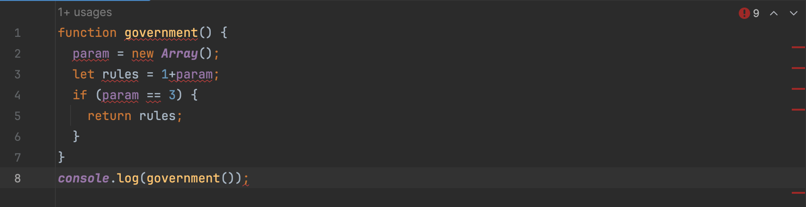
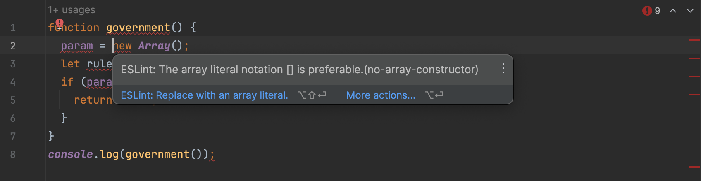
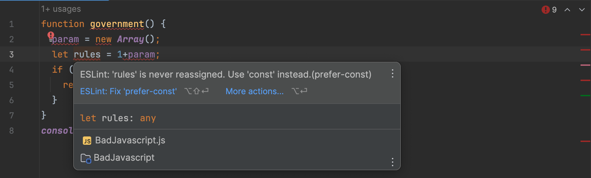
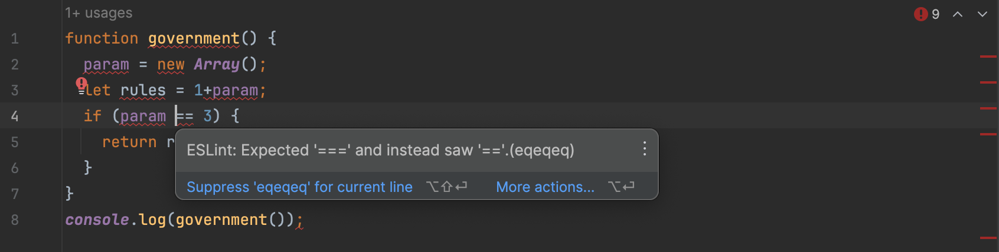

## Who makes the rules?

A government creates and enforces the rules of a society, maintains order, and provides assistance to the citizens. Similarly, coding standards are adhered by programmers to develop, execute, and share advanced successful code. Hence, I think of coding standards as the "Government of Code." 

### What are coding standards to begin with?

Coding standards are rules or conventions that order how code should be written in a programming language. They are for consistency, readability, and portability of code across projects and development among a team. Coding standards typically cover various aspects of practices, including of format/alignment, documentation, error and exception handling, and more. In order to disperse code for others to see or use, we must follow a specific standard for the code to execute successfully, and that is why coding standards are a must--like our government (without a government, citizens would be free to do whatever they want--whether good or bad--and we would probably not want that). Besides, coding standards have the ability to improve one in learning a programming language just like the way we can become a "better" person if we follow governmental rules.

## ESLint makes the rules

As a learning programmer in JavaScript, one tool that I have been utilizing to find and fix problems is ESLint in IntelliJ IDEA. ESLint shows up as a green checkmark or red error mark depending on what it detects from analyzing the code that you write. In my experience, when I first installed it into the developer environment, I had typed in an example code and that was the moment where I absolutely got humbled and judged with red error lines across my screen. As a person with a detail-oriented personality, it was surprising (and annoying) visually, and I immediately fixed what it told me to do for the satisfaction of the green checkmark.

Below is an image of how ESLint shows up when you have errors (I have modified code so that it relates to the context):

    

Below are images of the errors ESLint detected along with numerous suggestions:

    
    
    

Looking at the images above, we can see that ESLint detected fixes and let me know with red warning marks all over the code and scroll bar. They also gave suggestions on what I can do to improve my code! This was another surprise, where I found ESLint to be impressive for easy use and precisiveness in following code standard. Here, I started to think that ESLint is something that I needed all this time... I tend to stick with what I first learn and make them habits, however, ESLint offered me an opportunity to improve what I've been learning wrong. With around 2 clicks of ESLint advancements, I had the green checkmark in no time. This made me feel like a better programmer already, as my code executed smoothly as well. I could also share the code with another without having any errors on their end.

## So what now?

With the astonishment of impressiveness and how crucial coding standards are, I now apply ESLint to majority of the code I develop. As much as people dislike rules and laws, we must follow them to create a enhanced environment, and the same goes for coding! And that is why I now follow: the Government of Code.
