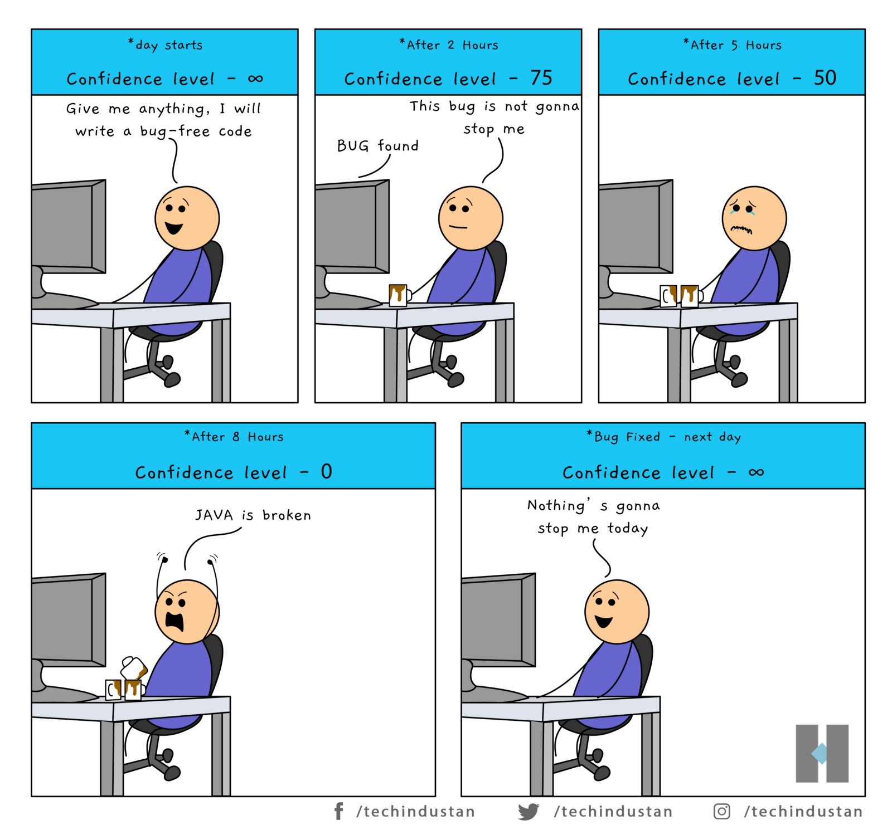

## How did I get here?

I was never certain of what I wanted to do after I graduated high school, but I was always curious and interested in many things. From wanting to be a nurse, news reporter, pilot, and more, I declared my major as business management for my college application to UH Manoa. I then was offered a direct admit program for the Shidler College of Business. I thought to myself, "Oh this is great, but is this really enough?" One day, I was on a road trip from Nevada to Utah to Arizona and that was when my uncle and I had a conversation on growing informational technology. Something inside me told me that I have to try this out, and two weeks before my first day at UH Manoa, I decided to take on a challenge as a BS Computer Science student.

## Journey with Coding with Heart

My passion for software engineering has been ignited by the uniqueness of programming, but also from the day I ran my first "Hello World" code. I was completely new to coding, and I don't think I'll ever forget how proud I was to show my parents that I can code. As I took on more assignments and larger in-class projects, I would eventually brag about it to my friends and grandparents. The dynamic intersection of innovation and problem solving to create solutions toward numerous challenges excited me. Not only the functional requirements of software development, but the style of design and execution being completely customizable is amazing to me.

Furthermore, I am enthusiastic about the upcoming challenges in software engineering. From internships, projects, and meeting new peers or people I can look up to, I aim to gain insights and skills beyond the course ICS 314. In my future endeavors as a software engineer, I aspire to enhance my proficiency in programming languages develop expertise in being able to solve and debug code efficiently. As the field is increasingly growing, I also hope to expand my knowledge in data science and artificial intelligence.
