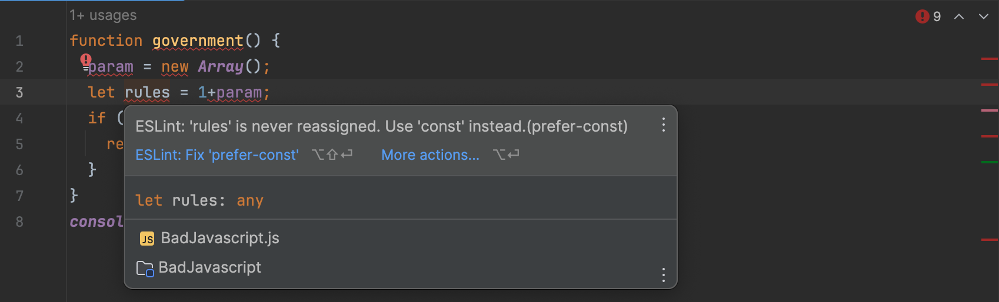

## Preamble: Who makes the rules?

A government establishes and enforces the rules of a society, maintains order, and provides assistance to the citizens. Similarly, coding standards are adhered by programmers to develop, execute, and share advanced successful code. Therefore, I consider coding standards to be the "Government of Code."

#### Wait... what are coding standards?

Coding standards are rules or conventions that order how code should be written in a programming language. They are for consistency, readability, and portability of code across projects and development among a team. Coding standards typically cover various aspects of practices, including of format/alignment, documentation, error and exception handling, and more. In order to disperse code for others to see or use, we must follow a specific standard for the code to execute successfully, and that is why coding standards are a must--like our government (without a government, citizens would be free to do whatever they want--whether good or bad--and we would probably not want that). Besides, coding standards have the ability to improve one in learning a programming language just like the way we can become a "better" person if we follow governmental rules.

## ESLint makes the rules

As a beginner programmer in JavaScript, one tool that I have been utilizing to identify and resolve issues in my code is ESLint. Integrated into IntelliJ development environment, ESLint aids in debugging code and making sure that the correct syntax is utilized. When code is analyzed, ESLint provides immediate feedback in the form of a green checkmark or red error mark, indicating whether the rules are being followed or not. This is a very useful tool when getting to know a form of programming language for the first time, as it assists with building habits on writing accurate and organized code.

Nevertheless, in my experience initially upon installing ESLint, I encountered a flood of red error lines when I typed in an example code. As someone who is detail-oriented, this was a surprising (and admittedly, annoying) experience. However, this immediate feedback motivated me to rectify the errors promptly, leading to the satisfaction of seeing the green checkmark.

Below are images of a look into how ESLint shows up when you have errors (I have modified code so that it relates to the context):

    

Below are images of the errors ESLint detected along with given suggestions:

    

    

    

Looking at the images above, ESLint detected issues and indicated them with red warning marks throughout the code and scroll bar. It also provided suggestions on how to improve the code, which I found to be impressive for its ease of use and precision in following code standards. This was a pleasant surprise, as I began to realize that ESLint is a tool that I needed all along.

I have a tendency to stick with my initial learning and habits, but ESLint offered me an opportunity to correct any misconceptions and improve my coding practices. With just a couple of clicks to apply ESLint's suggestions, I quickly achieved the green checkmark. This not only made me feel like a more competent programmer but also ensured that my code executed smoothly and error-free. Additionally, I could confidently share my code with others, knowing that it would be error-free on their end as well.

## Key Takeaways

With the astonishment of impressiveness and how crucial coding standards are, I now use ESLint with nearly all of my code. Just as people may dislike rules and laws but understand their necessity for creating an enhanced environment, coding standards are crucial for maintaining a clean and efficient codebase. This discovery has led me to embrace the concept of the "Government of Code," understanding that adherence to coding standards ultimately leads to better software development practices.
