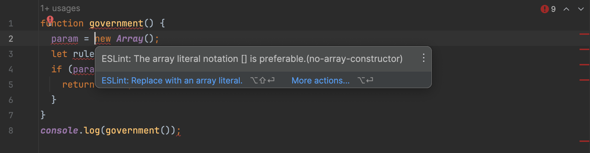

## Who makes the rules?

A government creates and enforces the rules of a society, maintains order, and provides assistance to the citizens. Similarly, coding standards are adhered by programmers to develop, execute, and share advanced successful code. Hence, I think of coding standards as the "Government of Code." 

### What are coding standards to begin with?

Coding standards are rules or conventions that order how code should be written in a programming language. They are for consistency, readability, and portability of code across projects and development amongs a team. Coding standards typically cover various aspects of practices, including of format/alignment, documentation, error and exception handling, and more. In order to disperse code for another to see or use, we must have a specific standard for the code to execute properly on the other end, and that is why coding standards are a must, just like our government (without a government, citizens would be free to do whatever they want--whether good or bad--and we would probably not want that). Besides, coding standards have the ability to improve one in learning a programming language just like the way we can become a "better" person if we follow governmental rules.

## ESLint makes the rules

As a learning programmer in JavaScript, one tool that I have been utilizing to find and fix problems is ESLint in IntelliJ IDEA. ESLint shows up as a green checkmark or red error mark depending on what it detects from analyzing the code that you write. In my experience, when I first installed it into the developer environment, I had typed in an example code and that was the moment where I absolutely got humbled and judged with red error lines across my screen. As a person with a detail-oriented personality, it was surprising (and annoying) visual, and I immediately fixed what it told me to do for the satisfactory of the green checkmark.

Below is an image of an example of ESLint error marks:

    

Below are images of the errors ESLint detected along with fix suggestions:

    
    
    

In the suggestion images above, we can see that ESLint detected fixes that needs to be done as well as suggested what I can do to improve my code! This was another surprise, where I started to think that ESLint is something that I needed. Personally, I tend to stick with what I first learn and make it a habit. Yet, ESLint offered me an opportunity to improve what I've learnt wrong and do it the coding standard way. With the easy use of around 2 clicks to improve my code, I had the green checkmark in no time. This way, my code execution would happen smoothly on myself and others ends too. 

## The foolproof way to get ignored.

Conclusion.
