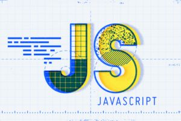

When first introduced to programming, you have this total feeling of anxiety and stress crawling up your spine. It’s like a Professor giving you a coding quiz on the first day of a beginner's Computer Science course. Well, quite literally, that happened to me in my freshman year of college when I had no prior experience or knowledge in programming. However, the feeling of satisfaction felt extraordinary when I first ran my one line of code in Java that took me 15 minutes to write out…and it worked! That is what motivated me to get here, but now feeling that spine-crawling feeling once again while learning a new language: JavaScript.

## Getting Comfortable

As of now, I am in the zone of getting comfortable with writing out functions, as I find them to be simpler than my first language, Java. Since Java is moreso a complex language, I would have to type out “public static void main (String[] args)” per new method, yet “function NAME (parameters)” is the only required expression per ‘function’ creation in JavaScript. Furthermore, being able to print strings in a similar manner such as “System.out.println” versus “console.log()” has allowed me to get used to JavaScript exceedingly.

Per conditional statements such as if statements or switch statements, they are also similarly used. This is where I realized that Java and JavaScript share almost the same syntax! With a bit of searching, I found out that Java and JavaScript syntaxes originate from the language C, which I enjoyed learning in the past (after Java), as well as C++.

## The Pushing Point... Athletic Software Engineering

While finding similarities and getting comfortable with JavaScript, I will admit that I am still a beginner to a completely new language. Having **W**orkout **O**f the **D**ay(s) (WODs) in ICS 314, I do find it a bit difficult to solve certain prompts given a short amount of time. I find myself to take more time in understanding concepts, and doing that in a speedy manner tends to terrify me. However, I feel that this will be my pushing point and motivate me to become a greater programmer and a better student in general. As stressful as it is, I want to do my best by applying my prior knowledge as well as new knowledge I will grasp, and hope to find it enjoyable one day.

## Closing the Script

As I have just taken a small step into this adventure, I look forward to seizing every opportunity I get in order to master JavaScript. Whilst overcoming the negative feelings, I want to say that I am excited to see the challenges I overcome to learn this highly efficient programming language that is widely used throughout the world.
