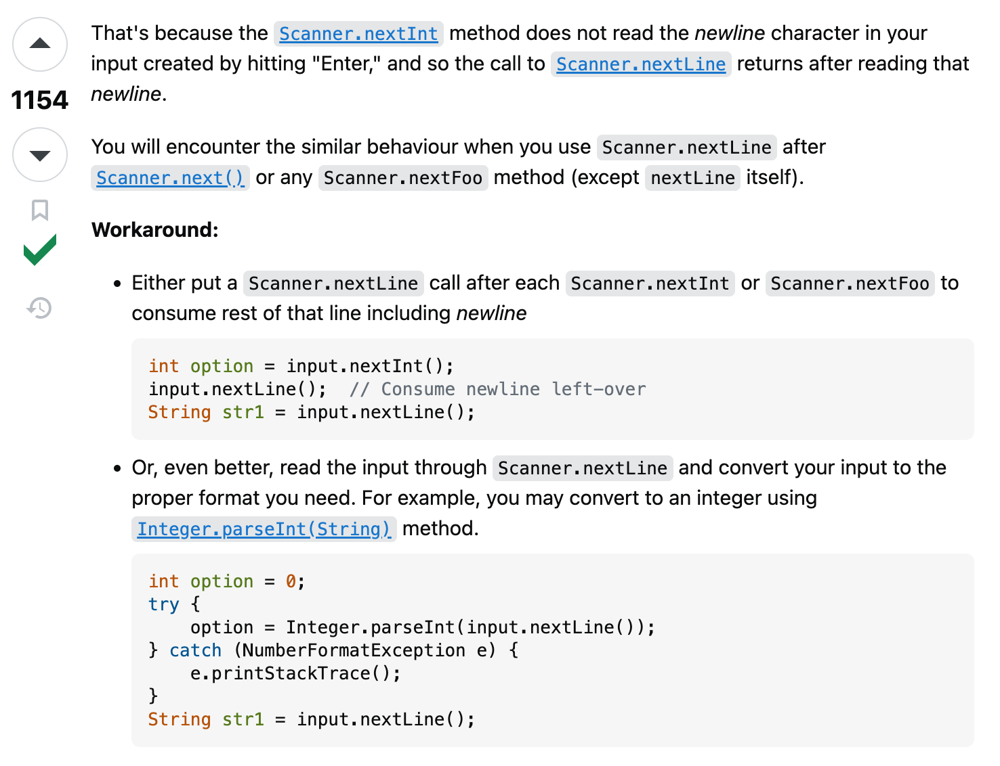

## The Challenge of Seeking Answers

Growing up in America in an international family means that my parents don't speak any English and being constantly bombarded with questions wherever I go, all of which are often expected to be translated by me. Throughout my 20 years of living in Hawaiʻi, my mother would always approach store employees or customer service with my hand in her hand but with numerous questions and complaints. I would feel frustrated and anxious, because first off I am a child, and the inquiries could come across as rude or bothersome.

Without my parents around, I developed a dislike for asking questions, fearing that they might sound "dumb," and that others would be displeased by me. I would often reassure myself saying, "I can look this up later on my own" or "It's fine, I'll figure it out somehow." However, hours later, I would always come to realization that the information I find is insufficient and I can't go back in time. Now, what do I do?

## Nurturing Success Through Words

Throughout software engineering, programmers run into various errors and bugs, and the effectiveness of asking "smart" questions becomes crucial. Whether it be in-person or online, we must find relevant information while effectively using courteous manners and not getting too side tracked in unnecessary tangents. This epic idea of smart questions has somehow made me confident in asking questions, and to dive further into what these questions are, we will be looking at some examples from Stack Overflow below.

First, I will review a question on Scanner methods, [Scanner is skipping nextLine() after using next() or nextFoo()?](https://stackoverflow.com/questions/13102045/scanner-is-skipping-nextline-after-using-next-or-nextfoo) 
This question was asked 11 years ago, featured with 854,000 views, 949 upvotes, and 25 replied answers. 

    

Why was this question so popular and viewed to this day? In one instance, we can see that the developer skillfully used a subject header that was simple and brief to grasp tech experts' attentions. They consicely stated what they attempted to do within their explanation as well, showing an understanding of the individual to some extent. Also, there were no unnecessary words in the subject header nor inappropriate language, and the description went straight to the point. They additionally provided snippets of their code and console outputs so that potential experts could clearly see what was causing the error, which they may have encountered before. Moreover, multiple comments implemented throughout their actual code allowed viewers to follow along with. Overall, everything was well communicated by the developer seeking a solution from experts, and I believe this developer used a "smart" question technique.

    

Then, with the "smart" question came the "smart" answer. The answer to the developer's question was explained in an easy manner along with an extra attached example that the developer could possibly look out for that may cause the error once again. What's more, 2 solutions were provided by experts! This proved that the art of asking a "smart" question was successful in not only helping the developer, but aided as a valuable resource for others in the software engineering community who may have also been in the same situation and looking for an solution.

## Unsuccessful Words

The following is a not so "smart" question that I have found on Stack Overflow: [Adventures in Installing a C#/WPF Application (WiX)](https://stackoverflow.com/questions/63305272/adventures-in-installing-a-c-wpf-application-wix).

    
    

Differing from the previous developer's "smart" question, this post was extensive. The developer did not much explain what their issue was, but more-so focused on expressing their frustration about the C#/WPF application--which made it seem like they weren't quite asking for help. In their subject heading, it resembled an essay instead of getting straight to the point and stating what was wrong or what they needed help with. Towards the end of their post, they finally asked their questions, "All I want is a simple installer that copies over the EXE and associated DLLs. Why is this so difficult? Can WiX do what I need? Or do I need a different installer toolkit?" With this tone, the question could be perceived as abrupt with no courtesy and convey a sense of urgency for the developer. Perhaps, these factors makde it difficult for potential experts to resolve the individual's issue. Personally, as a software engineer student myself, I would not want to reply even if I knew the solution. This individual's tone was not appreciated, and hence, there were 0 answers written back though this post being 3 years old.

## Final Thoughts on Improving Smart Inquiry

As a software engineer, not running into issues throughout programming is inevitable. This means that there will be many errors encountered anytime, even with a small mistake of forgetting to close a statement with a semi-colon. Hence, the skill of asking a "smart" question in an appropriate manner becomes vital. Whether asking your boss from work, peers in your group, or an online community, remembering the power of smart inquiry becomes crucial. Overall, I have learnt that I with the power of smart questions, people will be willing to help me and the importance of never hesitating to ask for help.
