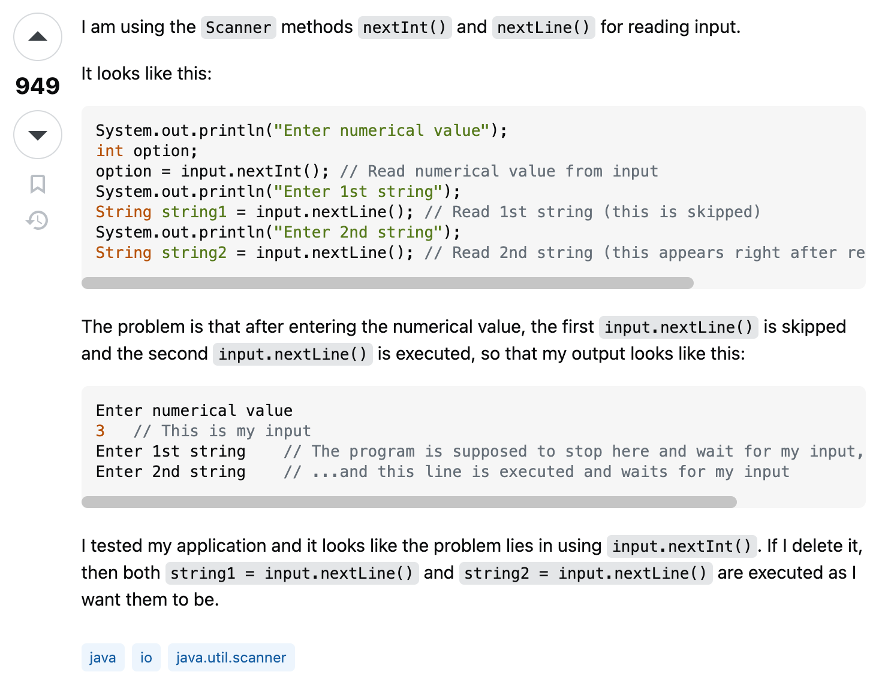
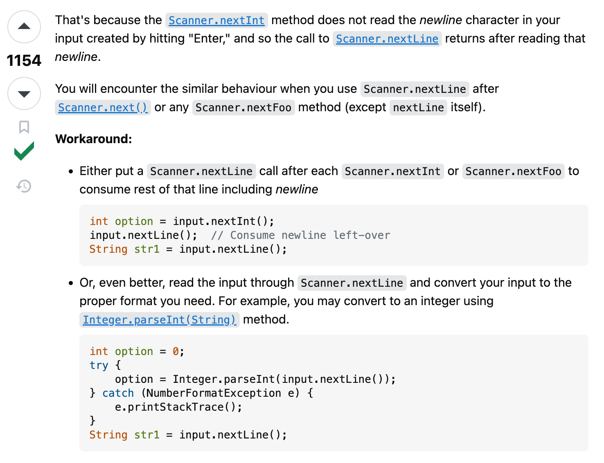

## The Challenge of Seeking Answers

Growing up in America as part of an international household where my parents didn't speak any English meant being constantly bombarded with questions wherever we went, all of which were often expected to be translated by me. In my experience, my mother would approach store employees or customer service with numerous questions and complaints, and I would feel frustrated and anxious because the inquiries could come across as rude or bothersome.

Without my parents around, I disliked asking any questions, fearing that they might sound "dumb," and that others would look down on me. I would reassure myself, saying, "I can look this up later on my own" or "It's fine, I'll figure it out somehow." However, hours later, after finding some answers online, I would always realize that the information wasn't sufficient. Now, what should I do?

## Nurturing Success Through Words

Throughout software engineering, programmers run into hundreds of errors and bugs and the effectiveness of asking "smart" questions becomes crucial. To dive deeper into what smart questions are, some examples of Stack Overflow will be implemented. 

First off, I will review a question on Scanner methods, [Scanner is skipping nextLine() after using next() or nextFoo()?](https://stackoverflow.com/questions/13102045/scanner-is-skipping-nextline-after-using-next-or-nextfoo) 
This question was asked 11 years ago, yet it was featured with 854,000 views with 949 upvotes and 25 replied answers. 

    

Why was this question so popular and viewed to this day? The developer first off skillfully used a subject header that was simple and brief to grasp tech experts' attentions. They consicely stated what they were trying to do within their explanation as well. There were no unnecessary words in the subject header nor inappropriate language, and went straight to the point. Additionally, they provided snippets of their code and console outputs so that potential experts could clearly see what was causing the certain error. Multiple comments implemented throughout their actual code allowed viewers to following along with the developer's perspective as well. Lastly, they mentioned how they have made an attempt with the pasted exact methods and I believe this overall effectively communicated a "smart" question. 

    

The answer to this question was understandably explained and an example that causes a similar behavior that could occur once again. What's more, 2 solutions were provided. The art of asking a "smart" question was therefore successful in not only helping the developer, but aided as a valuable resource for others who may have also been in the same situation looking for an answer. 

## Unsuccessful Words

The following is a not so "smart" question that I have found on Stack Overflow: [Adventures in Installing a C#/WPF Application (WiX)](https://stackoverflow.com/questions/63305272/adventures-in-installing-a-c-wpf-application-wix).

