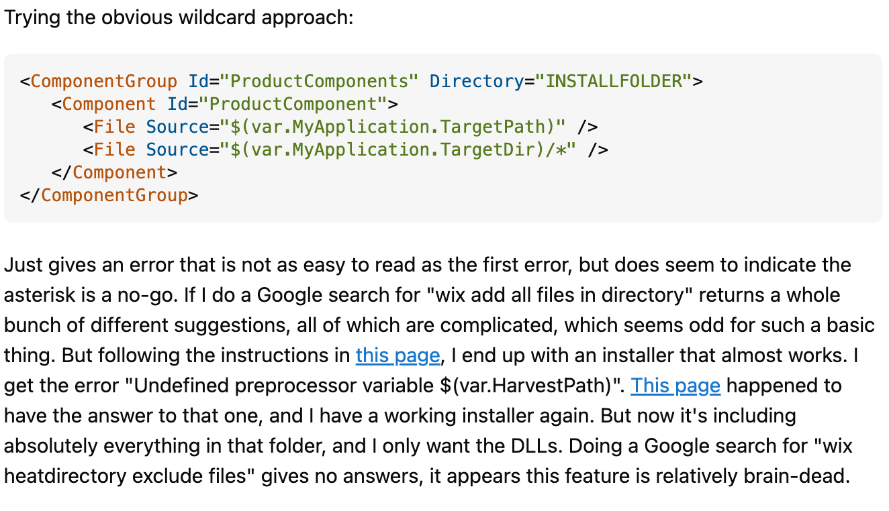

## The Challenge of Seeking Answers

Growing up in America as part of an international household where my parents didn't speak any English meant being constantly bombarded with questions wherever we went, all of which were often expected to be translated by me. In my experience, my mother would approach store employees or customer service with numerous questions and complaints, and I would feel frustrated and anxious because the inquiries could come across as rude or bothersome.

Without my parents around, I developed a dislike for asking questions, fearing that they might sound "dumb," and that others would look down on me. I would reassure myself saying, "I can look this up later on my own" or "It's fine, I'll figure it out somehow." However, hours later, after finding some sorts of answers online, I would always come to realization that the information is insufficient. Now, what do I do?

## Nurturing Success Through Words

Throughout software engineering, programmers run into hundreds of errors and bugs and the effectiveness of asking "smart" questions becomes crucial. Whether it be in-person or online, we must find relevant information effectively using courteous manners as well as not getting too side tracked in unnecessary tangents. To dive further into what "smart" questions are, some examples of Stack Overflow will be implemented below.

First off, I will review a question on Scanner methods, [Scanner is skipping nextLine() after using next() or nextFoo()?](https://stackoverflow.com/questions/13102045/scanner-is-skipping-nextline-after-using-next-or-nextfoo) 
This question was asked 11 years ago, featured with 854,000 views, 949 upvotes, and 25 replied answers. 

    

Why was this question so popular and viewed to this day? The developer first off skillfully used a subject header that was simple and brief to grasp tech experts' attentions. They consicely stated what they were trying to do within their explanation as well. There were no unnecessary words in the subject header nor inappropriate language, and went straight to the point. Additionally, they provided snippets of their code and console outputs so that potential helpers could clearly see what was causing the proposed error. Multiple comments implemented throughout their actual code allowed viewers to follow along with the developer's perspective. Overall, I believe this developer effectively communicated a "smart" question. 

    

With the "smart" question came the "smart" answer. The answer to the developer's question was understandably explained with an attached example that could cause a similar error that may occur once again. What's more, 2 solutions were provided! The art of asking a "smart" question was therefore successful in not only helping the developer, but aided as a valuable resource for others who may have also been in the same situation looking for an answer.

## Unsuccessful Words

The following is a not so "smart" question that I have found on Stack Overflow: [Adventures in Installing a C#/WPF Application (WiX)](https://stackoverflow.com/questions/63305272/adventures-in-installing-a-c-wpf-application-wix).

    
    

Differing from the previous developer's "smart" question, this post was extensive. The developer expressed their frustration about the C#/WPF application, which made it seem like they weren't quite asking for help. Regarding their subject heading, it more-so resembled an essay instead of stating what was wrong or what they needed help with--making it difficult for potential tech supporters to resolve the issue. Towards the end of their post, they finally asked their questions, "All I want is a simple installer that copies over the EXE and associated DLLs. Why is this so difficult? Can WiX do what I need? Or do I need a different installer toolkit?" With this tone, the question could be perceived as abrupt with no courtesy and convey a sense of urgency for the developer. Perhaps, I personally would not want to reply, and notably, there were 0 answers written back although this was posted 3 years ago.

## Final Thoughts on Improving Smart Inquiry

Finally, as a software engineer, collaboration with other developers is inevitable. This means that there will be many errors encountered as well as grappling with questions when confused or uncertain. Hence, the skill of asking a "smart" question in an appropriate manner is vital! Following the mannerisms of the article, *How to ask questions the smart way* I am aiming to put aside my social anxiety and achieve all the support I need from now on.
