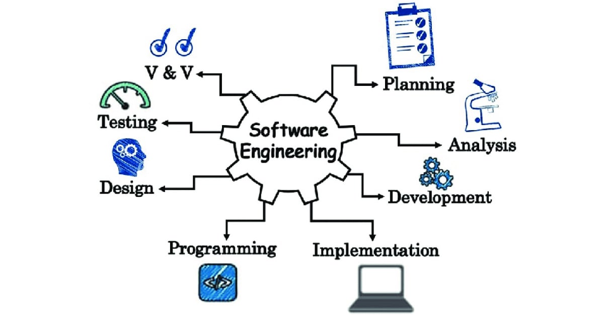

    

After completing the course, ICS 314: Software Engineering, I have gained a deeper understanding of several fundamental concepts that extend programming beyond just website application. This course has not only advanced my skills in web development but has also broadened my perspective on software engineering as a whole. Through hands-on projects and rigorous studying, I have come to appreciate the processes involved in creating robust software solutions. Two key topics that have stood out to me throughout this, are Agile Project Management and Design Patterns.

## Agile Project Management

Agile Project Management is a methodology that emphasizes iterative development, collaboration, and feedback. It prioritizes adaptability, allowing teams to respond to changes in requirements and deliver satisfaction to customers quickly. Throughout this, one specific style of Agile Project Management that I have learnt about is Issue Driven Project Management. This approach focuses on managing a project by identifying and addressing specific issues or tasks, rather than following a rigid plan. For example, in my recent project on developing a web application with a team of 6, we had set up milestones with various tasks assigned equally, as we would add on more when tasks were completed. Here, I have learnt the importance of issue driven project management, offering a versatile and adaptable approach to project management that can be applied to a wide range of projects and industries--making it a valuable skill for any software engineer.

## Design Patterns

Design Patterns are reusable solutions to common problems that arise during software design and development. They provide a template for solving specific design problems and help maintain a high level of code quality and reusability, which is crucial to myself as a software engineer. One example of a design pattern is the Observer pattern, that I particularly find usefulness in. It establishes a one-to-many dependency between objects, ensuring that when one object changes state, all its dependents are notified and updated automatically. This pattern is invaluable in scenarios where components of a system need to stay synchronized, enhancing the overall efficiency and reliability of the software. As I continue to grow as a software engineer, I recognize the importance of understanding and applying design patterns not just in web application development, but in all software projects.

More information on design patterns can be found in my previously written works, *[A Comfortable Pattern](https://rinaogino.github.io/essays/a-comfortable-pattern.html)*

## A Final Reflection

Overall, ICS 314 has broadened my understanding of software engineering beyond web application development. I've learned that concepts like Agile Project Management and Design Patterns are applicable to a wide range of projects and can significantly improve the efficiency and quality of software development processes.

With learning and programming many chapters of Javascript utilizing frameworks and such, I know that I have increased in progress around 99%! As for that, I would like to give a special shout out to my Professor, Teaching Assistant Alyssia, and my team mates, who have supported me along my journey!

*ChatGPT was used to correct minor grammar and spelling mistakes.*
