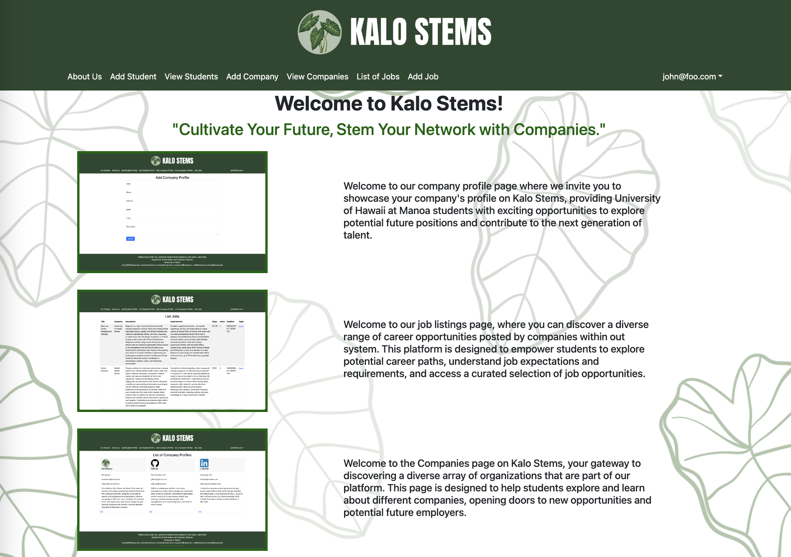
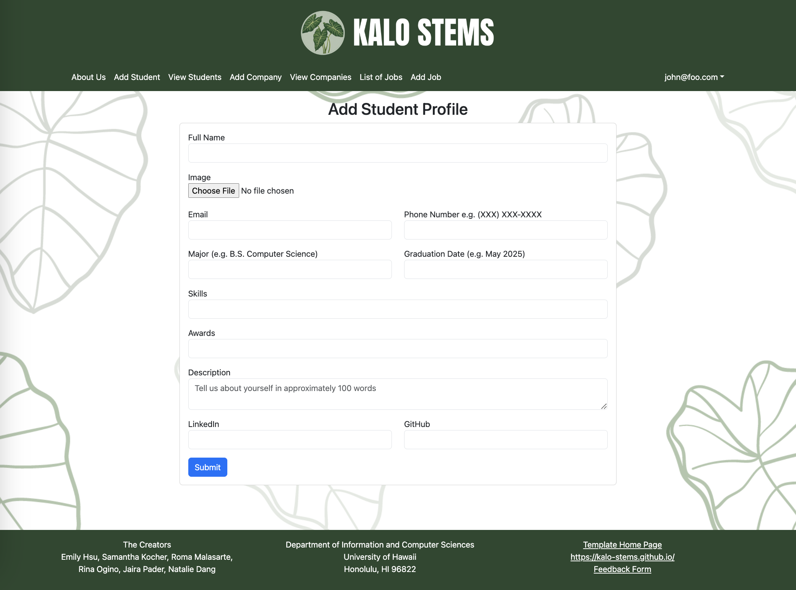
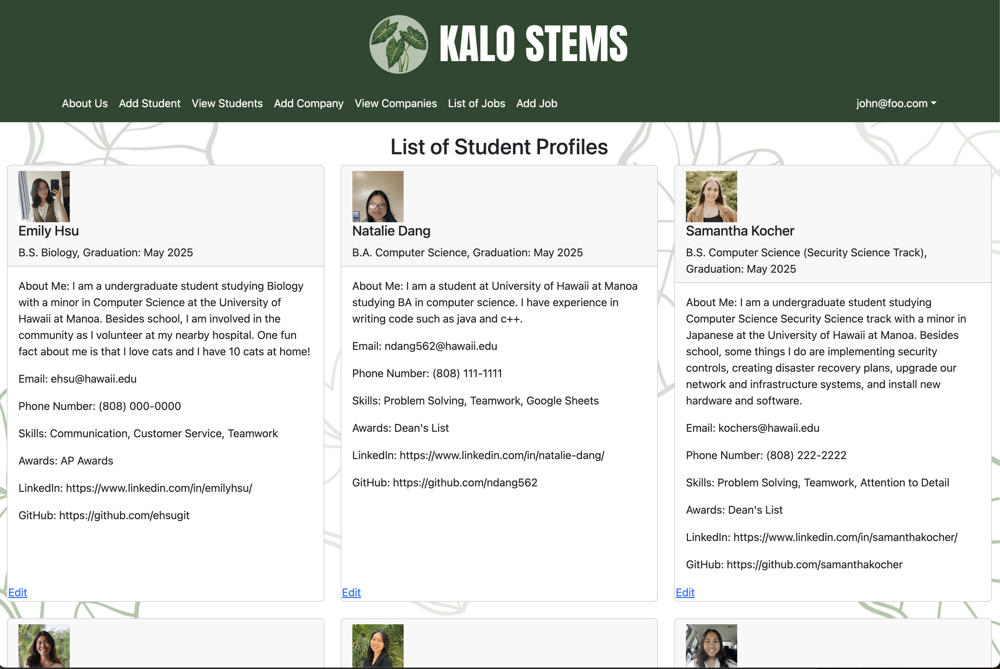
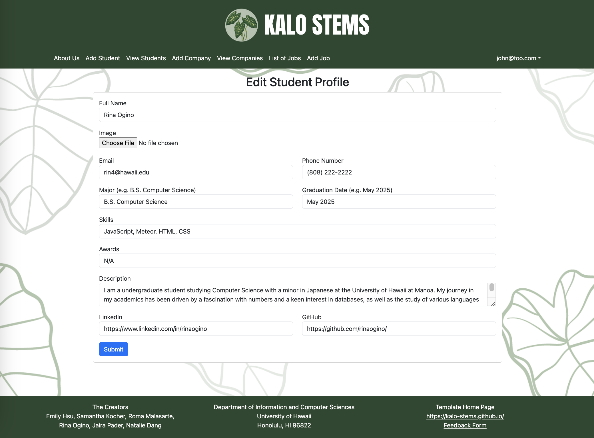

For my final project in ICS 314: Software Engineering, my team (Emily Hsu, Samantha Kocher, Roma Malasarte, Jaira Pader, and Natalie Dang) and I collaborated to develop a website application designed to enhance career connections and opportunities for University of Hawaiʻi students. This platform is highly similar to LinkedIn but with a focus on inclusivity, allowing students and companies to create detailed profiles. Students are able to showcase their skills and awards, linking to their LinkedIn and GitHub profiles, while companies can efficiently find suitable candidates for their job opportunities. Our goal was to create a seamless and empowering experience for students to explore and pursue career paths within our university community.

  

## My Contributions to Kalo Stems Growth

I played a crucial role in design and development of the student profile management system, focusing on the creation and editing functionalities. This involved designing user-friendly interfaces and implementing robust backend logic to ensure seamless profile management for students.

  

Pictured above is the Add Student Profile page, where students are able to create a comprehensive profile featuring their contact details, educational background, and links to their professional profiles on LinkedIn and or GitHub. One of the most challenging aspects was getting the image upload button to function correctly. While the image would load onto the page, saving it into the database required extensive debugging.

  

Furthermore, our application enhances the recruitment experience for employers by providing easy access to a curated list of candidates, as demonstrated above. Instead of a traditional table layout with rows of data, I have implemented a card-based design, which another co-founder (Jaira) and I came up with. This functionality not only offers a more visually appealing presentation but enhances usability to showcase skills and experiences, streamlining the recruitment process for both students and companies. 

  

Students are also given the ability to edit their information on the Edit Student Profile page. Upon updating their details, students will receive immediate feedback indicating whether the update was successful through a green checkmark. These changes are functioned to immediately reflect in the List Student page.

## Still Growing

My primary contributions to this project include developing the add, edit, and listing student pages. However, I have also been involved in various other tasks within Kalo Stems as well. From inception to deployment, my team and I have dedicated significant time and efforts to this project, and I am proud to see our hard work coming along. One of the most challenging moments was when our application crashed entirely, requiring us to spend around 3 hours undoing and re-committing all of our work from scratch. Additionally, some team members were absent, adding to our workload. Despite these challenges, the journey was incredibly rewarding, and I would gladly undertake it again. I've witnessed not only the growth of Kalo Stems, but also my personal development throughout this exciting process.

To view our Kalo Stems organization page, please visit [kalo-stems.github.io/](https://kalo-stems.github.io/).
