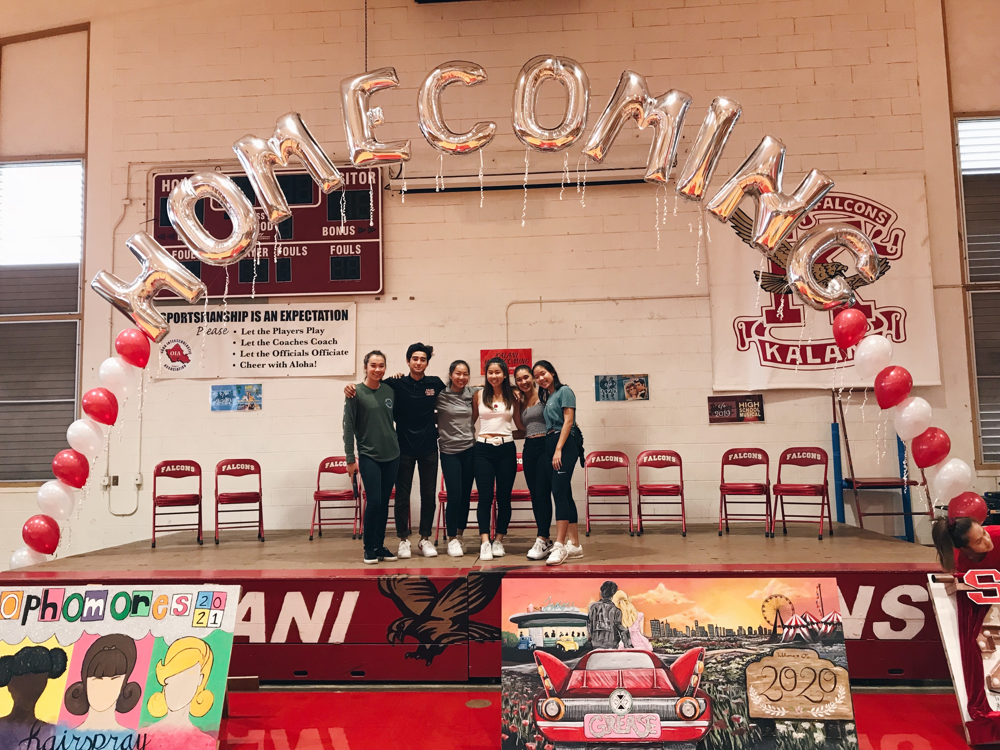

When I first moved to Hawai'i at the age of one, I never stood out because I could not speak, read, or write any English. I was also an awful artist, so I could never express my opinions. After living here for a while and accepting that I will be stuck with English having to be my primary language, I decided to step up in high school and join the class council. 

After actively participating in numerous events, my involvement eventually led to a opportunity. I was given the chance to join the main student body council that represented the entirety of my high school--the Kalani Association of Students (KAS).

  

## Leadership Responsibilites

When I first joined KAS, I quickly recognized the dedication required for the role. We were tasked with planning, budgeting, participating, and beyond in every school event, demanding a lot of time and effort to communicate with students and faculty. 

I spent my first year in KAS as a Student Community Council Representative where I attended meetings and was entrusted with the responsibility of representing the interests and concerns of my peers to the school administration. Progressing to the next year, I was appointed a Secretary position where I maintained meeting data and organized future tasks for the council. I took on additional responsibilities managing social media and analyzing for improvement to ensure satisfaction of students. 

Finally, I was elected as the student body President where I assumed a pivotal leadership role in overseeing all tasks to be done on time. From organizing school-wide events and spirit weeks to implementing community service, I worked relentlessly to create an inclusive and vibrant high school experience for everyone. 

## The Pathway to Presidency

In conclusion, my pathway from being a one year old newcomer to Hawai'i, struggling with language barriers and artistic challenges has transformed into a tale of growth and leadership. Joining the class council in high school created a turning point where I unlocked opportunities that eventually led to my role in the Kalani Association of Students!

My experience in KAS revealed the depth of dedication required for effective student leadership. Through various positions, I believe I contributed to creating a enjoyable and safe high school environment. My journey reflects on the power of challenging things in life, reinforcing the idea that personal growth is an ongoing process.

*Note that I used ChatGPT to improve grammar and spelling in this document.*
