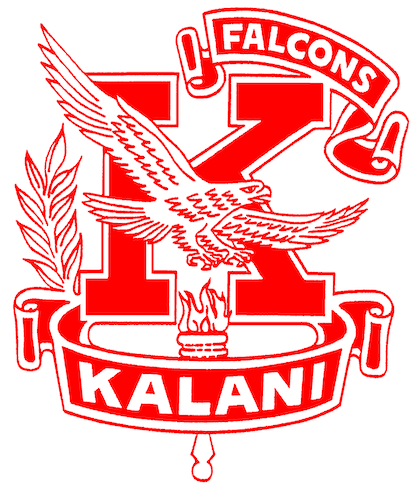

  

When I first moved to Hawai'i at the age of one, I never stood out because I could not speak, read, or write any English. I was also an awful artist, so I could never express my opinions. After living here for a while and accepting that I will be stuck with English having to be my primary language, I decided to step up in high school and join the class council. I participated in many events as possible, until one day, I was given the opportunity to work with the main student body council that represented my high school as a whole--the Kalani Association of Students (KAS).

When I first joined KAS, I realized that a lot of dedication was necessary. We were required to plan, budget, participate, and beyond in every school event whilst spending a lot of time and effort to communicate with students and faculty. I spent my first year in KAS as a Student Community Council Representative where I attended meetings and was entrusted with the responsibility of representing the interests and concerns of my peers to the school administration. Then, in the next year, I was appointed a Secretary position where I would maintain meeting data and organized what needed to be done next. I additionally stepped up to manage social media and analyze for improvement and satisfaction. Finally, I was elected to become the student body President where I assumed a pivotal leadership role in managing all work to be done on time. From organizing school-wide events and spirit weeks to implementing community service, I worked to create an inclusive and vibrant high school experience.
