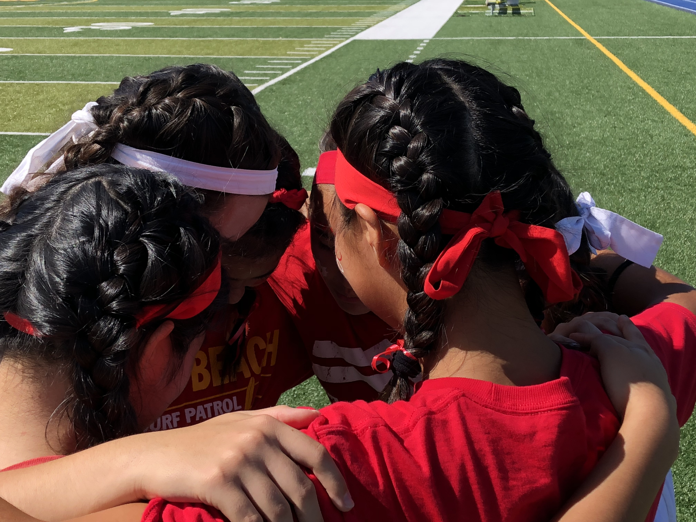
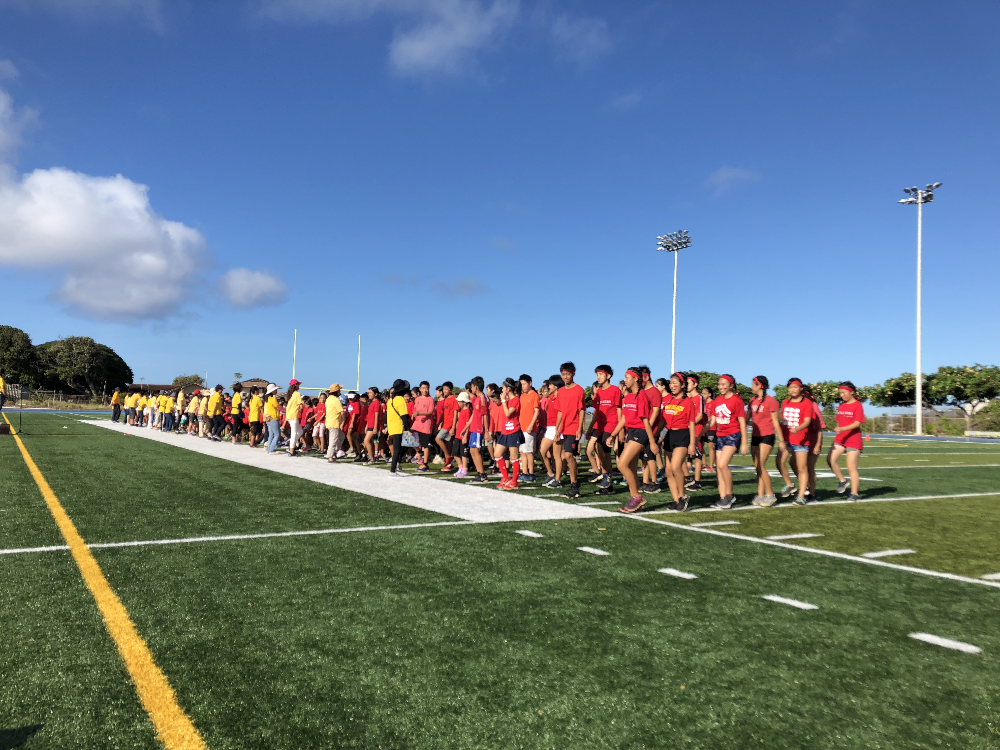
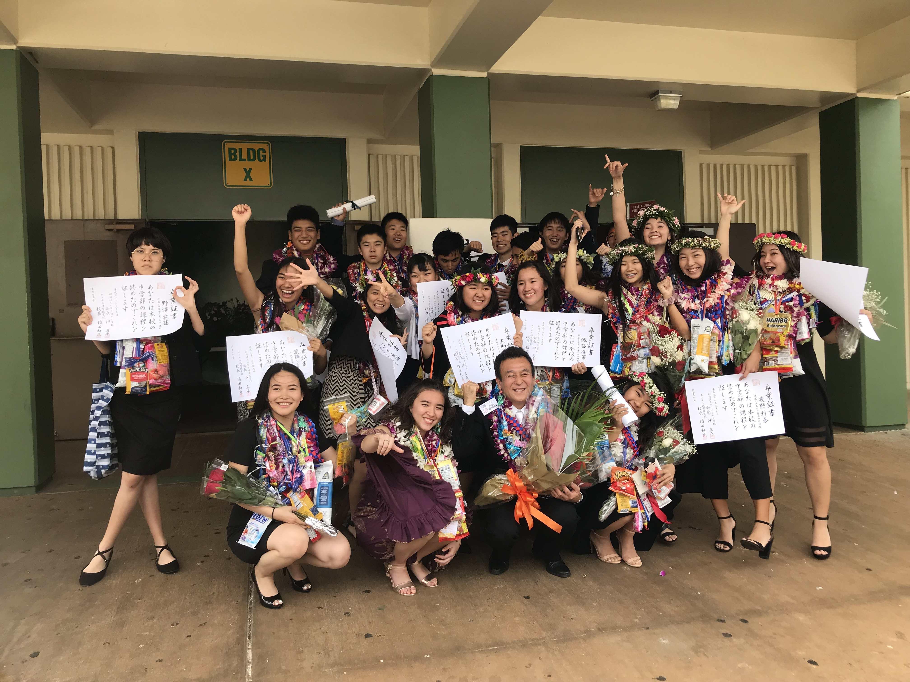

## About

From the age of 4, my life had been dedicated to the Hawaii Japanese School, also known as Rainbow Gakuen. Every Saturday from 8:30am to 3:30pm, hundreds of students gathered to learn a diverse curriculum spanning from grades K-8, using textbooks and workbooks approved by the Ministry of Education in Japan.

The classes were divided into six blocks, each focusing on history, culture, reading, and writing, all conducted in Japanese. Students were never really allowed to speak any language besides Japanese. Throughout this, as we progressed in reading and writing, weekly 'kanji test(s)' along with quarterly midterm and final examinations were given. These tests determined whether we could pass and move onto the next grade level or not, so my Fridays consisted of all-nighters where I was *efficienty* cramming to get my homework done and preparing for the kanji test that happened the following morning. Nonetheless, students were required to read the textbook out loud in class and to prevent embarrassment, I annotate and practiced rigorously beforehand. 

## Field Day Project

During an exciting week each school year, there was an annual sports day where students would be split into teams of red and white and competed against each other. The event included of various sports activities such as 100m sprint races, team relays, ball throwing, and more. Finally, there was a dance performance choreographed by the 8th grade students each year. 

As I entered the 8th grade, I was excited yet nervous for our upcoming performance. Our class had around 25 students, and orchestrating a perfect performance seemed difficult, especially considering that the majority lacked prior dance experience. Yet, when it came to planning and preparing the songs, I decided to take the lead to gather my peers' opinions and votes. This surprisingly went easier than I thought, as we picked out around 7 songs that would later be segmented to a 20 minute performance. Then came the part where we had to choreograph each part. The students met up weekly for almost a month prior to the performance, as we worked together tirelessly to perfect every move.

Finally, the day arrived where all of our efforts would be showcased to the entire school. Our performance surpassed my expectations, and served as a proof to our dedication and teamwork. We had successfully created something that we never thought we would, and revealed the potential within each of us.

## Never a Regretful Time

Besides the frightening details on how rigorous weekly Japanese school was, I formed enduring friendships. My classmates and I still reminisce about the intense testing and stress we faced, but truthfully it was the most significant project of our lives. I learned the importance of language learning, exposed me to a whole new language, and what I am capable of. レインボー学園、ありがとうございました。(translating to "thank you Rainbow Gakuen!")
